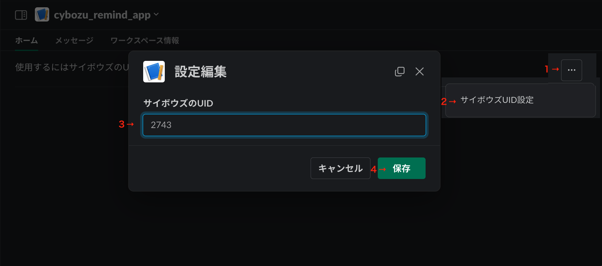
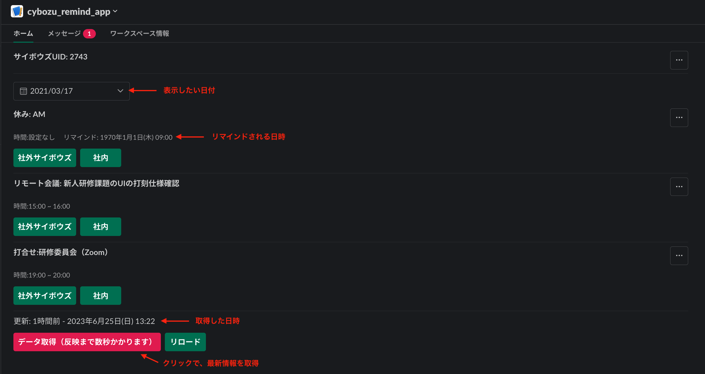
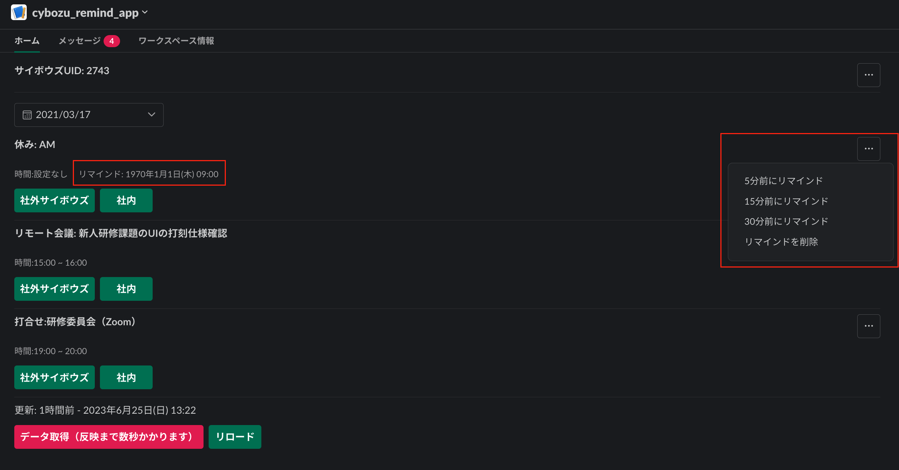
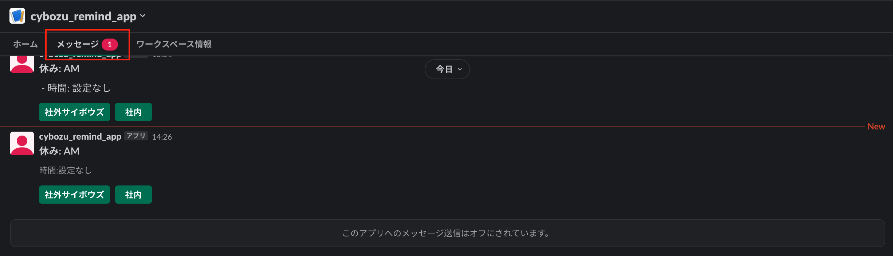
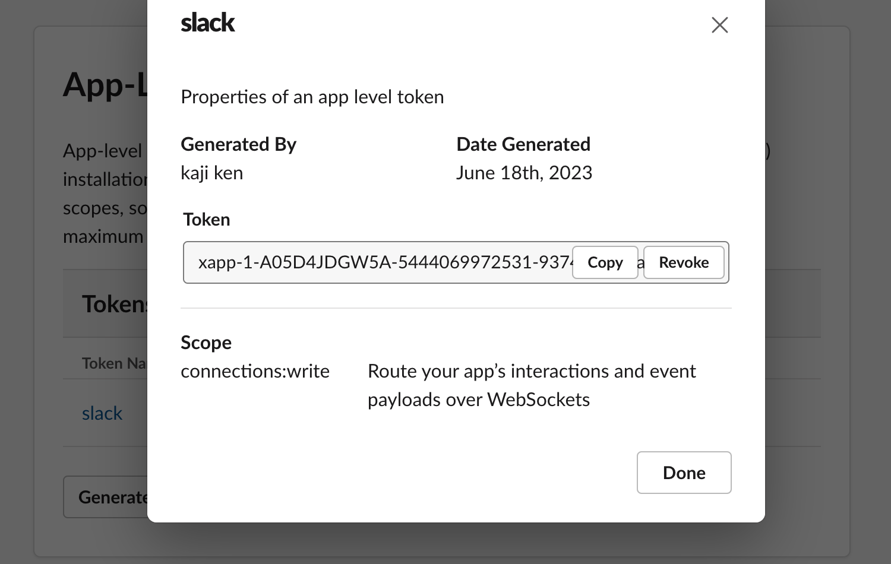

# REMIND_CYBOZU_APP

Slackでサイボウズのスケジュールを表示や予定時間の前にリマインドを設定できます。

## 使用方法

### 初期設定

取得したいサイボウズのUIDを設定  

  

### スケジュール取得

  

サイボウズから取得したデータをローカルに保存し、保存したデータを表示しています。  

データが登録されていない・再取得したい場合
 →「データを取得」をクリックで、サイボウズから最新データを取得します。  

### リマインド

  

右端のメニューでリマインドを設定できます。  
リマインドが設定されている場合、リマインド日時が追加で表示されます。  
**注意：リマインド設定後にスケジュールが変更された場合でも、リマインドの時間・内容は変更されません。**  

  

時間になるとDMで通知が来ます。

## 環境構築方法

1. slack_botを作成
*./manifest.yml* である程度作成できます。
（SLACK_APP_TOKENだけ手動で設定）
  

2. 以下のコマンドを実行

```bash
git clone このリポジトリのURL
cd remind_cybozu_app
make init
cp .env.example .env
vim .env
make up
```

以上

.env

```env
SLACK_BOT_TOKEN=<SLACK_BOT_TOKEN>
SLACK_APP_TOKEN=<SLACK_APP_TOKEN>
PRIVATE_KEY_DECRYPTION_PASSPHRASE="password"
BASIC_USER=ADアカウントユーザー
BASIC_PASS=ADアカウントパスワード
CYBOZU_URL1=社外用サイボウズURL
CYBOZU_URL2=社内用URL
CYBOZU_UID=サイボウズユーザー
CYBOZU_PASS=サイボウズバスワード

```
